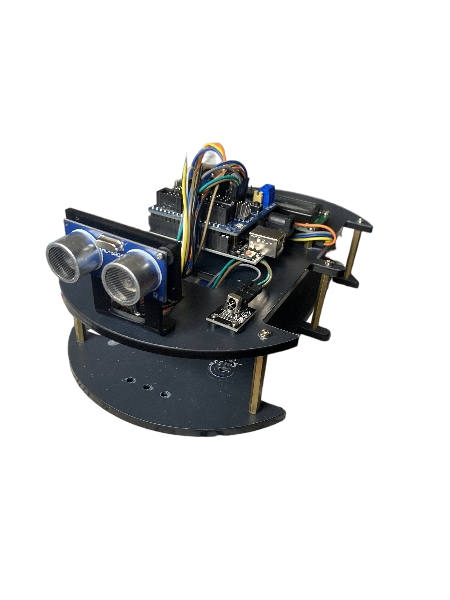

# Ultrasonic IR Obstacle Detector 🚧📡

This Arduino project uses an ultrasonic sensor and IR remote to switch between modes and detect obstacles at different distance thresholds.

## 🔧 Features
- IR remote to switch between:
  - Mode 1: Any distance
  - Mode 2: < 100 cm
  - Mode 3: < 50 cm
- LCD feedback for obstacle detection
- Real-time distance measurement using HC-SR04

## 🧰 Hardware Used
- Arduino Uno
- HC-SR04 Ultrasonic Sensor
- IR Receiver
- IR Remote
- LCD (I2C 16x2)
- Breadboard & Jumpers

## 📷 Device

## 🎮 IR Remote Codes
See [`extras/ir_remote_codes.txt`](extras/ir_remote_codes.txt) for tested codes.

## 🗂️ How to Use
1. Upload `obstacle_detector.ino` to your Arduino.
2. Connect the hardware as per the schematic.
3. Use IR remote buttons:
   - "1" → Mode 1
   - "2" → Mode 2 (< 100cm)
   - "3" → Mode 3 (< 50cm)
4. Watch the LCD for distance or obstacle alerts.

## 📚 Libraries Required
Install these in the Arduino IDE:
- `IRremote` by shirriff or z3t0
- `LiquidCrystal_I2C`

## 📜 License
MIT License
